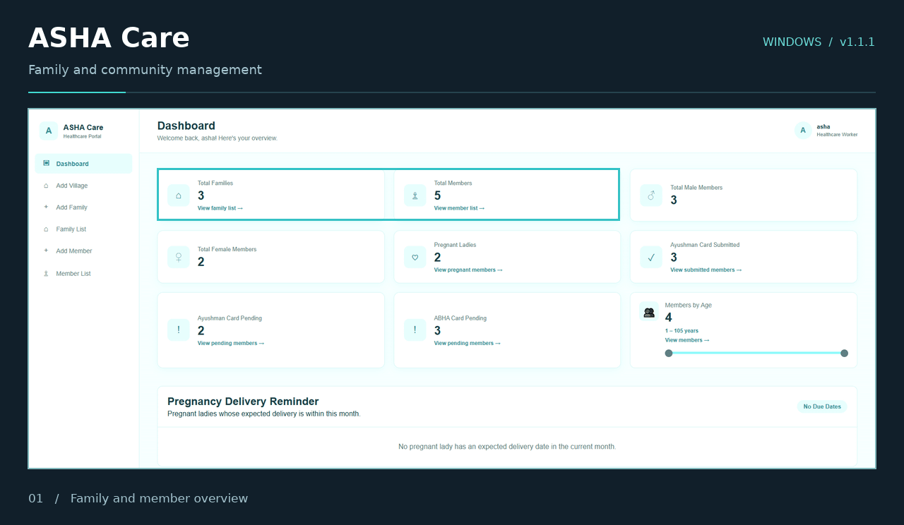
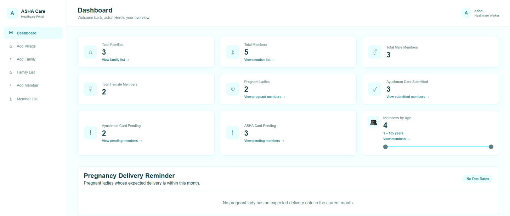

<h1>ASHA Care</h1>

<h3>Family records. Community insights. Everyday care.</h3>

A family and community management application for ASHA workers and nursing staff. Organize households, maintain member records, and review healthcare summaries from one dashboard.

  
  
  

 

Download the installer, complete setup, and launch ASHA Care.

  <a href="#application-preview">Preview</a> &nbsp;·&nbsp;
  <a href="#features">Features</a> &nbsp;·&nbsp;
  <a href="#installation">Installation</a> &nbsp;·&nbsp;
  <a href="https://github.com/ZaidShaikh-2005/community-help/releases">Releases</a> &nbsp;·&nbsp;
  <a href="https://github.com/ZaidShaikh-2005/community-help/issues">Support</a>

---

## Application preview

Animated dashboard preview created from the application screenshot.

View the dashboard screenshot

 

## Overview

ASHA Care brings family registration, member information, and healthcare summaries into a single workflow. Register a family, associate its members, and return to their records whenever information needs to be reviewed or updated.

The dashboard provides an overview of the community, including family and member totals, pregnancy information, and Ayushman and ABHA card status.

<table>
<tr>
<td width="33%" valign="top">
<h3>Organize records</h3>

Keep family details and associated member records together, with search and straightforward navigation.

</td>
<td width="33%" valign="top">
<h3>Review care summaries</h3>

See pregnancy delivery reminders, demographic totals, and health card summaries on the dashboard.

</td>
<td width="33%" valign="top">
<h3>Install on Windows</h3>

Use the packaged installer to set up the application without configuring a development environment.

</td>
</tr>
</table>

## Features

| Module | What it provides |
| :--- | :--- |
| **Access** | Six-digit PIN login with an administrator-managed PIN. |
| **Village organization** | An Add Village workflow alongside family and member management. |
| **Family management** | Add families, store household details, search records, and view associated members. |
| **Member management** | Add members to families, search and view their records, and edit member information. |
| **Community dashboard** | Family and member totals, male and female member summaries, and an age-range overview. |
| **Pregnancy overview** | Pregnant member summaries and reminders for expected deliveries within the current month. |
| **Health card overview** | Ayushman card submitted and pending summaries, alongside ABHA card pending status. |
| **Windows distribution** | A setup executable that installs the packaged application. |

## Installation

**Current installer:** `AshaNurseApp_Setup_v1.1.1.exe`

1. Click **Download for Windows** at the top of this page.
2. Open `AshaNurseApp_Setup_v1.1.1.exe` from your Downloads folder.
3. Follow the setup wizard to install the application.
4. Launch **ASHA Care** using the shortcut created during installation.
5. Sign in with the six-digit PIN provided by your administrator.

The installer includes the packaged application. A separate Python installation, repository download, or command-line setup is not required for end users.

[View version 1.1.1](https://github.com/ZaidShaikh-2005/community-help/releases/tag/v1.1.1) · [Browse all releases](https://github.com/ZaidShaikh-2005/community-help/releases)

## Everyday workflow

1. **Register a family.** Enter the household details and create its family record.
2. **Add family members.** Associate individual member records with the family.
3. **Review the dashboard.** Check community totals, pregnancy summaries, and health card status.
4. **Maintain the records.** Search for a family or member, review the details, and update member information as needed.

## Built through Community Help

ASHA Care began with a practical family and member management requirement shared through the GitHub Community. The project translates that requirement into a Django application with a Windows installation package.

[Read the community response](https://github.com/orgs/community/discussions/208038#discussioncomment-18501894) · [View the original discussion](https://github.com/orgs/community/discussions/208038)

## Support and feedback

Use [GitHub Issues](https://github.com/ZaidShaikh-2005/community-help/issues) to report a problem or suggest an improvement. Include the application version, steps to reproduce the issue, and any relevant error message. Remove personal and patient information from screenshots or examples before sharing them.

---

<strong>ASHA Care</strong> 
Developed by <a href="https://github.com/ZaidShaikh-2005">Zaid Shaikh</a> · Community Help

